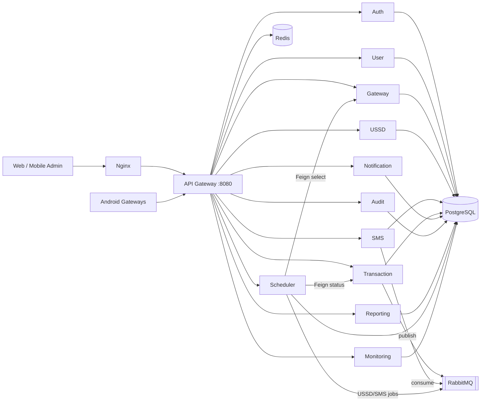
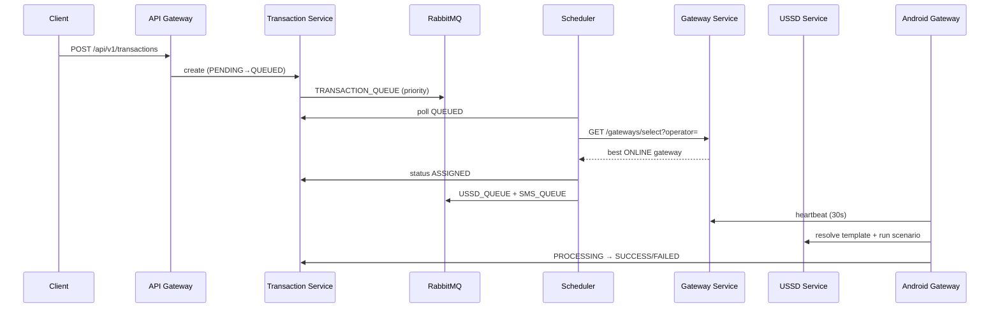

# Architecture — OS Gateway Backend

## Vue d'ensemble

OS Gateway orchestre des **gateways Android** pour exécuter des opérations Mobile Money (Orange, Moov, Malitel) via **USSD** et **SMS**. Le backend est découpé en microservices Spring Boot, derrière un API Gateway, avec PostgreSQL (état), Redis (rate-limit/cache) et RabbitMQ (jobs prioritaires).

## Diagramme de contexte

## Flux transactionnel

## Sélection de gateway

Critères (dans l'ordre) :

1. Opérateur demandé
2. Statut `ONLINE`
3. Batterie > 20%
4. Internet disponible
5. Charge (`loadScore`) la plus faible
6. Meilleure force réseau
7. Idle le plus long (`lastIdleAt`)

## Messaging

| Queue | Routing key | Priorités |
|-------|-------------|-----------|
| `osgateway.transaction.queue` | `transaction.job` | URGENT=10, NORMAL=5, BASSE=1 |
| `osgateway.sms.queue` | `sms.job` | idem |
| `osgateway.notification.queue` | `notification.job` | idem |
| `osgateway.ussd.queue` | `ussd.job` | idem |

## Architecture hexagonale (par service)

Chaque microservice suit :

- `api` — Controllers + DTOs OpenAPI
- `application` — Use cases / services
- `domain` — Entités JPA
- `infrastructure` — Repositories, Feign, RabbitMQ, WebSocket
- `config` — Beans Spring

## Sécurité

- JWT access (court) + refresh (persisté / révocable)
- Validation JWT au niveau API Gateway
- RBAC : `ADMIN`, `SUPERVISOR`, `DISTRIBUTEUR`, `OPERATOR`, `GATEWAY`
- HMAC / AES utilitaires dans `common` pour signatures device et secrets
- Rate limiting Redis (fenêtre fixe / IP)

## Observabilité

- Actuator + Prometheus scrape (`monitoring-service`, etc.)
- Grafana pour dashboards
- Audit logs pour actions critiques
