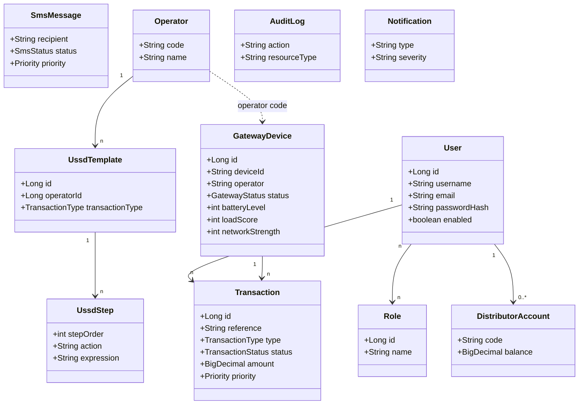
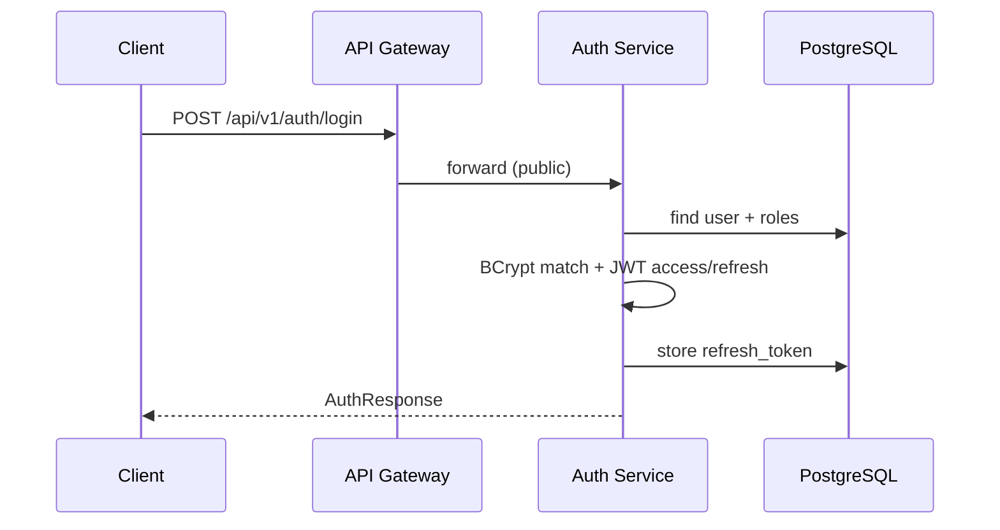
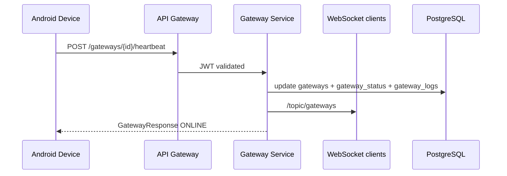
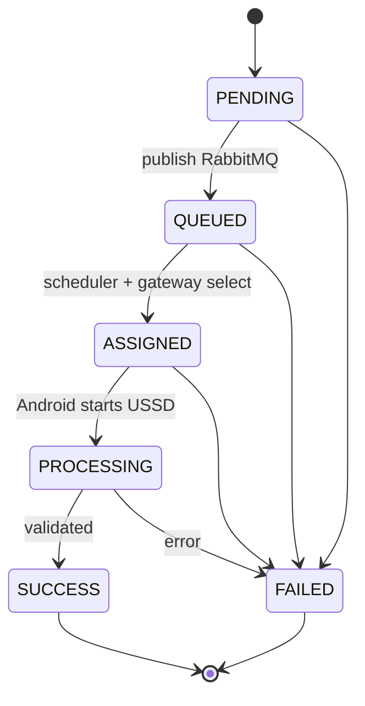

# UML — OS Gateway

## Class diagram (core domain)

```mermaid
classDiagram
  class User {
    +Long id
    +String username
    +String email
    +String passwordHash
    +boolean enabled
  }
  class Role {
    +Long id
    +String name
  }
  class GatewayDevice {
    +Long id
    +String deviceId
    +String operator
    +GatewayStatus status
    +int batteryLevel
    +int loadScore
    +int networkStrength
  }
  class Transaction {
    +Long id
    +String reference
    +TransactionType type
    +TransactionStatus status
    +BigDecimal amount
    +Priority priority
  }
  class UssdTemplate {
    +Long id
    +Long operatorId
    +TransactionType transactionType
  }
  class UssdStep {
    +int stepOrder
    +String action
    +String expression
  }
  class SmsMessage {
    +String recipient
    +SmsStatus status
    +Priority priority
  }
  class Operator {
    +String code
    +String name
  }
  class DistributorAccount {
    +String code
    +BigDecimal balance
  }
  class AuditLog {
    +String action
    +String resourceType
  }
  class Notification {
    +String type
    +String severity
  }

  User "n" --> "n" Role
  User "1" --> "0..*" DistributorAccount
  Operator "1" --> "n" UssdTemplate
  UssdTemplate "1" --> "n" UssdStep
  User "1" --> "n" Transaction
  GatewayDevice "1" --> "n" Transaction
  Operator ..> GatewayDevice : operator code
```

## Sequence — login

```mermaid
sequenceDiagram
  participant C as Client
  participant AG as API Gateway
  participant A as Auth Service
  participant DB as PostgreSQL

  C->>AG: POST /api/v1/auth/login
  AG->>A: forward (public)
  A->>DB: find user + roles
  A->>A: BCrypt match + JWT access/refresh
  A->>DB: store refresh_token
  A-->>C: AuthResponse
```

## Sequence — gateway heartbeat

```mermaid
sequenceDiagram
  participant D as Android Device
  participant AG as API Gateway
  participant G as Gateway Service
  participant WS as WebSocket clients
  participant DB as PostgreSQL

  D->>AG: POST /gateways/{id}/heartbeat
  AG->>G: JWT validated
  G->>DB: update gateways + gateway_status + gateway_logs
  G->>WS: /topic/gateways
  G-->>D: GatewayResponse ONLINE
```

## State machine — transaction

```mermaid
stateDiagram-v2
  [*] --> PENDING
  PENDING --> QUEUED: publish RabbitMQ
  QUEUED --> ASSIGNED: scheduler + gateway select
  ASSIGNED --> PROCESSING: Android starts USSD
  PROCESSING --> SUCCESS: validated
  PROCESSING --> FAILED: error
  PENDING --> FAILED
  QUEUED --> FAILED
  ASSIGNED --> FAILED
  SUCCESS --> [*]
  FAILED --> [*]
```
